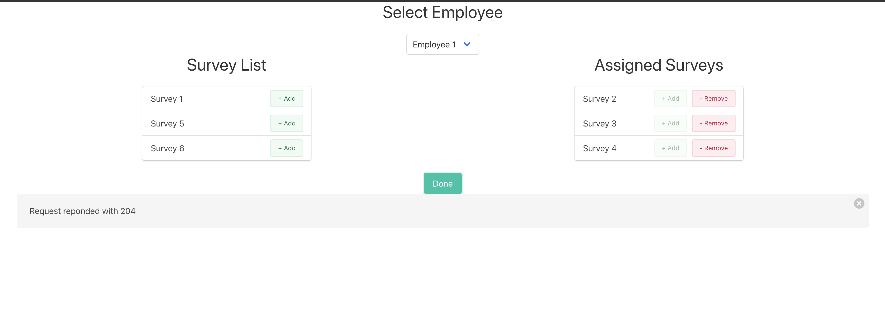
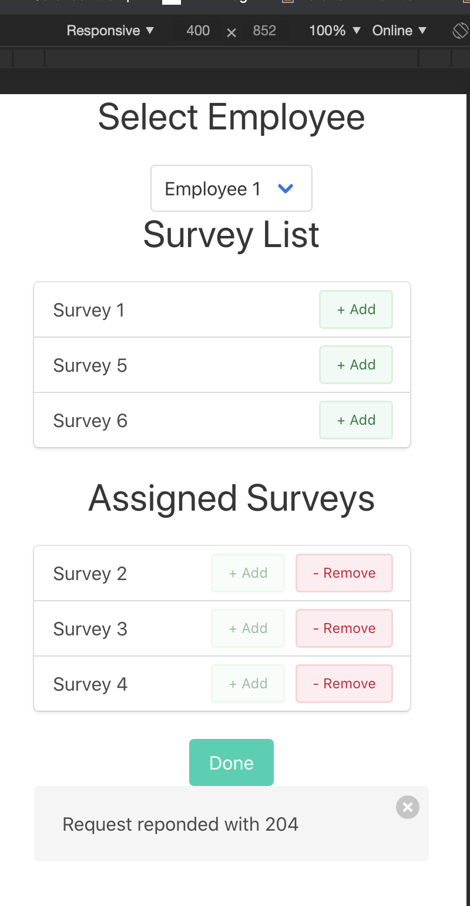

# React-Express-Task
### Technology used:
* Express.js
* React.js
* Redux
* Bulma framework

### How to run the project locally?
After cloning the repo and moving into the repo directory, perform below steps:
* Install all npm dependencies `npm install` 
* Move to client folder and install npm dependencies for client-side as well `npm install` 
* Install concurrently to run react.js and server project together `npm i -g concurrently`
* Run the project using `npm run dev`

### Screenshot

